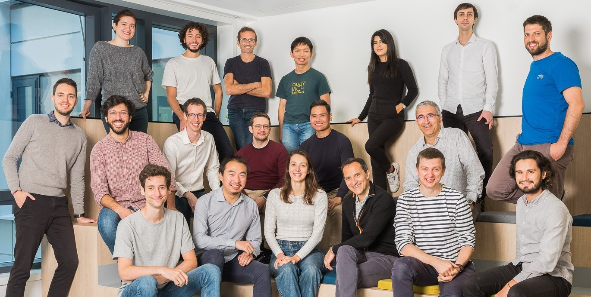

An international team based in Paris, which conducts AI research for [Valeo](http://valeo.com) automotive applications, in collaboraton with world-class academics. Our main research is on reliable and sustainable automotive AI. See our [papers](https://ptrckprz.github.io/vaipub), [projects](https://valeoai.github.io/blog/projects), [codes](https://github.com/valeoai), [posts](https://valeoai.github.io/blog) and [tweets](https://twitter.com/valeoai). 

###  Team
  
**Florent Bartoccioni**, PhD student (with Inria) | [linkedin](https://www.linkedin.com/in/flobarto/)   
**Alexandre Boulch**, research scientist | [page](http://www.boulch.eu/) | [scholar](https://scholar.google.com/citations?user=iJ3qFGAAAAAJ&hl=fr&oi=ao)| [github](https://github.com/aboulch) | [twitter](https://twitter.com/AlexandreBoulch)  
**Andrei Bursuc**, senior scientist | [page](https://abursuc.github.io/) | [scholar](https://scholar.google.com/citations?user=HTfERCsAAAAJ&hl=en) | [github](https://github.com/abursuc/) | [twitter](https://twitter.com/abursuc)  
**Laura Calem**, PhD student (with CNAM) | [github](https://github.com/lcalem) | [twitter](https://twitter.com/lauracalem)  
**Mickaël Chen**, research scientist | [page](https://sites.google.com/view/mickaelchen/home) | [scholar](https://scholar.google.fr/citations?user=QnRpMJAAAAAJ&hl=en) | [github](https://github.com/mickaelChen/)  
**Matthieu Cord**, principal scientist (and prof. at Sorbonne U.) | [page](http://www-poleia.lip6.fr/~cord/) | [scholar](https://scholar.google.fr/citations?user=SpAotDcAAAAJ&hl=en) | [twitter](https://twitter.com/quobbe)   
**Spyros Gidaris**, research scientist | [scholar](https://scholar.google.fr/citations?user=7atfg7EAAAAJ&hl=en) | [github](https://github.com/gidariss)   
**David Hurych**, research scientist | [scholar](https://scholar.google.cz/citations?user=XY1PVwYAAAAJ&hl=en)  
**Renaud Marlet**, principal scientist (and researcher at ENPC) | [page](http://imagine.enpc.fr/~marletr/) | [scholar](https://scholar.google.fr/citations?user=2rclwh4AAAAJ&hl=en)  
**Bjoern Michele**, PhD student  
**Patrick Pérez**, scientific director (and Valeo VP of AI) | [page](https://ptrckprz.github.io/) | [scholar](https://scholar.google.fr/citations?user=8Cph5uQAAAAJ&hl=en)  
**Cédric Rommel**, research scientist | [page](https://cedricrommel.github.io/) | [scholar](https://scholar.google.com/citations?user=GBv4KYwAAAAJ) | [twitter](https://twitter.com/ccrommel)  
**Gilles Puy**, research scientist | [page](https://sites.google.com/site/puygilles/home) | [scholar](https://scholar.google.com/citations?user=enaORE8AAAAJ&hl=en)  
**Corentin Sautier**, PhD student  
**Tristan Schultz**, research engineer  
**Oriane Siméoni**, research scientist | [page](https://osimeoni.github.io/) | [scholar](https://scholar.google.com/citations?user=PC7ELtEAAAAJ&hl=en) | [github](https://github.com/osimeoni)  
**Tuan-Hung Vu**, research scientist | [page](https://tuanhungvu.github.io/) | [scholar](https://scholar.google.fr/citations?user=QIHrPZQAAAAJ&hl=en) | [github](https://github.com/tuanhungvu) | [twitter](https://twitter.com/tuanhungvu89)  
**Yihong Xu**, research scientist | [scholar](https://scholar.google.fr/citations?user=vMLRRVkAAAAJ)  
**Eloi Zablocki**, research scientist | [scholar](https://scholar.google.fr/citations?hl=en&user=dOkbUmEAAAAJ) | [twitter](https://twitter.com/EloiZablocki)  
**Léon Zheng**, PhD student (with ENS Lyon) | [page](https://leonzheng2.github.io/)

**Human Resource Partner**: [Alain Phetsinghane](mailto:alain.phetsinghane@valeo.com)  
**Assistant**: [Ouafa Bakrine](mailto:ouafa.bakrine@valeo.com)  
**Location**: [100 rue de Courcelles](https://goo.gl/maps/LPCmZTD1GZo36qWU6), Paris  

### Some projects

*Multi-sensor perception* — Automated driving relies first on a variety of sensors, like Valeo's [fish-eye cameras](https://www.valeo.com/en/360-vue/), [LiDARs](https://www.valeo.com/en/valeo-scala/), radars and [ultrasonics](https://www.valeo.com/en/ultrasonic-parking-sensors/). Exploiting at best the outputs of each of these sensors at any instant is fundamental to understand the complex environment of the vehicle and gain robustness. To this end, we explore various machine learning approaches where sensors are considered either in isolation (as radar in [Carrada](https://arxiv.org/abs/2005.01456) at ICPR'20) or collectively (as in [xMUDA](https://valeoai.github.io/blog/publications/xmuda/) at CVPR'20).  

*3D perception* — Each sensor delivers information about the 3D world around the vehicle. Making sense of this information in terms of drivable space and important objects (road users, curb, obstacles, street furnitures) in 3D is required for the driving system to plan and act in the safest and most comfortable way. This encompasses several challenging tasks, in particular detection and segmentation of objects in point clouds as in [FKAConv](https://valeoai.github.io/blog/publications/fkaconv/) at ACCV'20.  

*Frugal learning* — Collecting diverse enough data, and annotating it precisely, is complex, costly and time-consuming. To reduce dramatically these needs, we explore various alternatives to fully-supervised learning, e.g, training that is unsupervised (as [rOSD](https://valeoai.github.io/blog/publications/rosd/) at ECCCV'20), self-supervised (as [BoWNet](https://valeoai.github.io/blog/publications/bownet/) at CVPR'20 and [OBoW](https://arxiv.org/abs/2012.11552) at CVPR'21), semi-supervised, active, zero-shot (as [ZS3](https://valeoai.github.io/blog/publications/zs3/) at NeurIPS'19) or few-shot. We also investigate training with fully-synthetic data (in combination with unsupervised domain adaptation) and with GAN-augmented data (as with Semantic Palette at CVPR'21 and [DummyNet](https://arxiv.org/abs/2012.08274) at AAAI'21).  

*Domain adaptation* — Deep learning and reinforcement learning are key technologies for autonomous driving. One of the challenges they face is to adapt to conditions which differ from those met during training. To improve systems' performance in such situations, we explore so-called "domain adaptation" techniques, as in [AdvEnt](https://valeoai.github.io/blog/publications/advent/) at CVPR'19 and [DADA](https://valeoai.github.io/blog/publications/dada/) its extension at ICCV'19.  

*Reliability* — When the unexpected happens, when the weather badly degrades, when a sensor gets blocked, the embarked perception system should continue working or, at least, diagnose the situation to react accordingly, e.g., by calling an alternative system or the human driver. With this in mind, we investigate ways to improve the robustness of neural nets to input variations, including to adversarial attacks, and to predict automatically the performance and the confidence of their predictions as in [ConfidNet](https://valeoai.github.io/blog/publications/confidnet) at NeurIPS'19. 

*Driving in action* — Getting from sensory inputs to car control goes either through a modular stack (perception > localization > forecast > planning > actuation) or, more radically, through a single end-to-end model. We work on both strategies, more specifically on action forecasting, automatic interpretation of decisions taken by a driving system, and reinforcement / imitation learning for end-to-end systems (as in [RL work](https://openaccess.thecvf.com/content_CVPR_2020/html/Toromanoff_End-to-End_Model-Free_Reinforcement_Learning_for_Urban_Driving_Using_Implicit_Affordances_CVPR_2020_paper.html) at CVPR'20).    

*Core Deep Learning* — Deep learning being now a key component of AD systems, it is important to get a better understanding of its inner workings, in particular the link between the specifics of the learning optimization and the key properties (performance, regularity, robustness, generalization) of the trained models. Among other things, we investigate the impact of popular batch normalization on standard learning procedures and the ability to learn through unsupervised distillation.      

### Code and data
* [LaRa](https://github.com/valeoai/LaRa): Latents and rays for multi-camera BEV semantic segmentation (CoRL'22) 
* [BiB](https://github.com/huyvvo/BiB): Active learning strategies for weakly-supervised object detection (ECCV'22)
* [D&S](https://github.com/vobecant/DriveAndSegment): Unsupervised semantic segmentation of urban scenes via cross-modal distillation (ECCV'22) 
* [STEEX](https://github.com/valeoai/STEEX): Steering Counterfactual Explanations with Semantics (ECCV'22)
* [CAB](https://github.com/valeoai/CAB): Raising Context Awareness in Motion Forecasting (workshop CVPR'22)
* [MuHDi](https://github.com/valeoai/MuHDi): Multi-head distillation for continual unsupervised domain adaptation in semantic segmentation ([CLVision'22](https://arxiv.org/abs/2204.11667))
* [SLidR](https://github.com/valeoai/SLidR): Image-to-Lidar self-supervised distillation for autonomous driving data ([CVPR'22](https://arxiv.org/abs/2203.16258))
* [RADIal](https://github.com/valeoai/RADIal) ([dataset](https://www.dropbox.com/s/y5kptmgxcngesp7/RADIal.zip)): HR radar dataset (+ camera & lidar) for vehicle and free space detection ([CVPR'22](https://arxiv.org/abs/2112.10646))
* [LOST](https://github.com/valeoai/LOST): Object localization with self-supervised transformers (BMVC'21) 
* [MTAF](https://github.com/valeoai/MTAF): Multi-Target Adversarial Frameworks for domain adaptation (ICCV'21)
* [PCAM](https://github.com/valeoai/PCAM): Product of Cross-Attention Matrices for rigid registration of point clouds (ICCV'21)
* [SP4ASC](https://github.com/valeoai/SP4ASC): Separable convolutions for [acoustic scene classification in DCASE'21 Challenge](http://dcase.community/challenge2021/task-acoustic-scene-classification-results-a).
* [MVRSS](https://github.com/valeoai/MVRSS): Multi-view radar semantic segmentation (ICCV'21)
* [ObsNet](https://github.com/valeoai/obsnet): Out-Of-Distribution detection by learning from local adversarial attacks in semantic segmentation (ICCV'21)
* [Semantic Palette](https://github.com/valeoai/SemanticPalette): Guiding scene generation with class proportions (CVPR'21) 
* [Attributes with Fields](https://github.com/vita-epfl/detection-attributes-fields): Detecting 32 pedestrian attributes with composite fields (T-ITS)
* [OBoW](https://github.com/valeoai/obow): Online BoW generation for unsupervised representation learning (CVPR'21)  
* [DummyNet](https://github.com/vobecant/DummyNet): Artificial Dummies for Urban Dataset Augmentation (AAAI'21)
* [CARRADA](https://github.com/valeoai/carrada_dataset) ([dataset](http://download.tsi.telecom-paristech.fr/Carrada/Carrada.tar.gz)): Camera and Automotive Radar with Range-Angle-Doppler Annotations dataset (ICPR'20)
* [ESL](https://github.com/valeoai/ESL): Entropy-guided Self-supervised Learning for Domain Adaptation in Semantic Segmentation (workshop CVPR'20)
* [FLOT](https://github.com/valeoai/FLOT): Scene flow on point clouds guided by optimal transport (ECCV'20)
* [AdamSRT](https://github.com/ymontmarin/adamsrt): Adam exploiting BN-induced pherical invariance of CNN (arXiv 2020)
* [LightConvPoint](https://github.com/valeoai/LightConvPoint): Convolution for points (ACCV'20)
* [xMUDA](https://github.com/valeoai/xmuda): Cross-modal UDA for 3D semantic segmentation (CVPR'20)
* [LearningByCheating](https://github.com/valeoai/LearningByCheating): End-to-End driving using implicit affordances (CVPR'20)  
* [rOSD](https://github.com/huyvvo/rOSD): Unsupervised object discovery at scale (ECCV'20)  
* [ConvPoint](https://github.com/aboulch/ConvPoint): Convolutions for unstructured point clouds (Computer \& Graphics 2020)  
* [BEEF](https://github.com/valeoai/BEEF): Driving behavior explanation with multi-level fusion (workshop NeurIPS'20 and Pattern Recognition'22) 
* [Woodscape](https://woodscape.valeo.com/): Driving fisheye multi-task dataset (ICCV'19)
* [ZS3](https://github.com/valeoai/ZS3): Zero-Shot Semantic Segmentation (NeurIPS'19)
* [BF3S](https://github.com/valeoai/BF3S): Boosting few-shot visual learning with self-supervision (ICCV'19)
* [ConfidNet](https://github.com/valeoai/ConfidNet): Addressing failure prediction by learning model confidence (NeurIPS'19)
* [Rainbow-IQN Ape-X](https://github.com/valeoai/rainbow-iqn-apex): effective RL combination for Atari games
* [DADA](https://github.com/valeoai/DADA): Depth-aware Domain Adaptation in Semantic Segmentation (ICCV'19)
* [AdvEnt](https://github.com/valeoai/ADVENT): Adversarial Entropy minimization for domain adaptation in semantic segmentation (CVPR'19)
* [OSD](https://github.com/huyvvo/OSD): Unsupervised object discovery as optimization (CVPR'19)  

###  Academic partners
CTU, Prague ([Josef Sivic](https://www.di.ens.fr/~josef/))  
EPFL, Lausanne ([Alexandre Alahi](https://people.epfl.ch/alexandre.alahi))  
ENPC, Paris ([Mathieu Aubry](http://imagine.enpc.fr/~aubrym/), [David Picard](https://davidpicard.github.io/), [Vincent Lepetit](https://vincentlepetit.github.io/))  
ENS & Inria, Lyon ([Rémi Gribonval](https://scholar.google.com/citations?user=EcqbX1QAAAAJ))  
Inria & PR[AI]RIE, Paris ([Jean Ponce](https://www.di.ens.fr/~ponce/))   
Inria Paris ([Raoul de Charette](https://team.inria.fr/rits/membres/raoul-de-charette/))     
Inria, Grenoble ([Karteek Alahari](https://lear.inrialpes.fr/people/alahari/))  
Sorbonne, Paris ([Matthieu Cord](http://www-poleia.lip6.fr/~cord/), [Nicolas Thome](http://cedric.cnam.fr/~thomen/))  
Télécom, Paris ([Florence d'Alché-Buc](https://scholar.google.com/citations?user=-qbL7z0AAAAJ), [Gaël Richard](https://scholar.google.com/citations?user=xn70tPIAAAAJ&hl=en), [Slim Essid](https://perso.telecom-paristech.fr/essid/))

### News
* 12/2022: Cédric Rommel starts as research scientist.
* 11/2022: We have 4 internships open, looking for outstanding ML/CV master students. 
* 11/2022: Huy defends his PhD at ENS.
* 10/2022: Yihong Xu starts as research scientist.
* 09/2022: ObsNet ranks first on [SegmentMeIfYouCan benchmark](https://segmentmeifyoucan.com/leaderboard) (Anomaly Track) among methods with no OoD training data.
* 09/2022: Patrick Pérez contributes to the [Czech-French workshop on AI](https://czech-french-ai.eu/) in Prague.
* 08/2022: Valeo.ai contributes to the [Weakly Supervised Computer Vision workshop](https://wscv-indaba.github.io/) at the Deep Learning Indaba in Tunis.
* 08/2022: Valeo.ai is part of Astra, the new Inria-Valeo join team on autonomous driving.
* 07/2022: [Code](https://github.com/huyvvo/BiB) for our ECCV'22 paper "Active learning strategies for weakly-supervised object detection".
* 07/2022: [Code](https://github.com/valeoai/STEEX) for our ECCV'22 paper "Steering Counterfactual Explanations with Semantics".
* 07/2022: Our survey on the [Explainability of vision-based autonomous driving systems](https://arxiv.org/abs/2101.05307) accepted in IJCV.
* 07/2022: Tutorial "Self-supervision on wheels: Advances in self-supervised learning from autonomous driving data" accepted at ECCV'22.
* 07/2022: Six [papers](https://ptrckprz.github.io/vaipub) accepted at ECCV'22.
* 06/2022: Valeo.ai presents 4 papers and 3 worshop papers at CVPR'22.  
* 05/2022: Patrick Pérez delivers a keynote at Autonomy 2.0 ICRA workshop.    
* 05/2022: Oriane and Renaud are Outstanding Reviewers at CVPR'22.
* 04/2022: [Code](https://github.com/valeoai/MuHDi) for our CLVision'22 workshop paper "Multi-head distillation for continual unsupervised domain adaptation in semantic segmentation".  
* 04/2022: Antoine Saporta defends his PhD at Sorbonne University.
* 03/2022: Geoffrey Bouquot, Valeo CTO, highlights several team's projects on [augmented perception of autonomous vehicles](https://www.nvidia.com/en-us/on-demand/session/gtcspring22-s42391/) at Nvidia GTC.  
* 03/2022: [Code](https://github.com/valeoai/SLidR) for our CVPR'22 paper "Image-to-Lidar Self-Supervised Distillation for Autonomous Driving Data".
* 03/2022: Matthieu Cord delivers a keynote at the Explainable AV Workshop of the European Commission Joint Research Centre.
* 03/2022: Work on forecasting multipe, diverse and feasible, trajectories, accepted at ICPR. 
* 03/2022: Arthur Ouaknine and Charles Corbière defend their PhD at Telecom and CNAM respectively.
* 03/2022: [Paper](https://ptrckprz.github.io/vaipub) on [Cross-modal Learning for Domain Adaptation in 3D Semantic Segmentation]() accpeted in PAMI.
* 03/2022: Four [papers](https://ptrckprz.github.io/vaipub) accepted at [CVPR](https://cvpr2022.thecvf.com/) (25.3% acceptance rate).
* 12/2022: [RADIal](https://github.com/valeoai/RADIal) dataset (HR radar, camera, lidar) for vehicle and free space detection is available.   
* 10/2021: The team presents 6 papers with codes at ICCV ([post](https://valeoai.github.io/blog/2021/10/08/valeoai-at-iccv-2021.html)). 
* 10/2021: Three [papers](https://ptrckprz.github.io/vaipub) accepted at [3DV](https://3dv2021.surrey.ac.uk/).
* 09/2021: One [paper](https://ptrckprz.github.io/vaipub) accepted at [NeurIPS](https://nips.cc/).
* 09/2021: Preprint on [object localization with self-supervised transformers and no Labels](https://arxiv.org/abs/2109.14279), with [code](https://github.com/valeoai/LOST).
* 09/2021: The team moves in the beautiful new [Valeo headquarter](https://goo.gl/maps/ChAzS42Y8kXUDDrG7), 100 rue de Courcelles, in Paris. 
* 08/2021: [Paper](https://ptrckprz.github.io/vaipub) on [Handling new target classes in semantic segmentation with domain adaptation](https://arxiv.org/abs/2004.01130) accpeted in CVIU.
* 08/2021: [Paper](https://ptrckprz.github.io/vaipub) on [Detecting 32 pedestrian attributes for autonomous vehicles](https://arxiv.org/abs/2012.02647) with [code](https://github.com/vita-epfl/detection-attributes-fields) accepted in T-IST.
* 08/2021: [Code](https://github.com/valeoai/MVRSS) for our ICCV'21 paper "Multi-view radar semantic segmentation".
* 08/2021: [Code](https://github.com/valeoai/obsnet) for our ICCV'21 paper "Triggering Failures: Out-Of-Distribution detection by learning from local adversarial attacks in Semantic Segmentation".
* 08/2021 Renaud Marlet among the [Outstanding Reviewers of ICCV'21](http://iccv2021.thecvf.com/outstanding-reviewers).
* 07/2021: Matthieu Cord on [self-supervised](https://www.lemonde.fr/sciences/article/2021/07/20/la-reconnaissance-d-images-par-l-ordinateur-fait-un-pas-de-geant_6088953_1650684.html) learning in French newspaper Le Monde.
* 07/2021: Six [papers](https://ptrckprz.github.io/vaipub) accepted at [ICCV'21](http://iccv2021.thecvf.com/) (25.9% acceptance rate).
* 07/2021: [Code](https://github.com/valeoai/SemanticPalette) for our CVPR'21 paper "Semantic Palette: Guiding scene generation with class proportions".
* 06/2021: Spyros Gidaris to serve as Area Chair for CVPR 2022.
* 06/2021: Renaud Marlet to serve as Meta-reviewer for BMVC 2021.
* 06/2021: Valeo.ai participates to CVPR'21 presenting three papers, co-organizing a [tutorial on self-supervised learning](https://gidariss.github.io/self-supervised-learning-cvpr2021/) and the [OmniCV workshop](https://sites.google.com/view/omnicv2021) and delivering keynotes at [SAIAD](https://sites.google.com/view/saiad2021) and [Vision4AllSeason](https://vision4allseason.net/) workshops.
* 06/2021: Matthieu Cord serves as Area Chair for NeurIPS 2021.
* 05/2021 Alexandre Boulch, Andrei Bursuc, Matthieu Cord, Renaud Marlet, Spyros Gidaris and Tuan-Hung Vu among the [Outstanding Reviewers of CVPR'21](http://cvpr2021.thecvf.com/node/184).
* 05/2021: Paper on [Confidence estimation via auxiliary models](https://arxiv.org/abs/2012.06508) accepted in IEEE T-PAMI.
* 04/2021: [Woodscape Challenge](https://sites.google.com/view/omnicv2021/woodscape-challenge) on fisheye semantic scene segmentation in conjunctin with CVPR'21 OmniCV workshop.
* 03/2021: Marin Toromanoff defends his PhD at MinesParis, committee: O. Pietquin, Th. Chateau, P.-Y. Oudeyer, R. Munos, Ch. Gagne, F. Moutarde, X. Perrotton.
* 03/2021: Three [papers](https://ptrckprz.github.io/vaipub) accepted at [CVPR'21](http://cvpr2021.thecvf.com/) (23.7% acceptance rate).
* 02/2021: Matthieu Cord delivers keynote at [Machine Learning Prague](https://www.mlprague.com/).
* 02/2021: Blog [post](https://valeoai.github.io/blog/2021/02/18/explainable-driving.html) on the explainability of neural driving models.
* 01/2021: Preprint on [Cross-modal learning for domain adaptation in 3D semantic segmentation](https://arxiv.org/abs/2101.07253).
* 01/2021: Preprint on the [Explainability of vision-based autonomous driving systems](https://arxiv.org/abs/2101.05307).
* 12/2020: Preprint on [Online BoW prediction for unsupervised representation learning](https://arxiv.org/abs/2012.11552) with [code](https://github.com/valeoai/obow).  
* 12/2020: Valeo participates with keynote and posters to [ML4AD](https://ml4ad.github.io/) virtual workshop at NeurIPS'20.
* 12/2020: One [paper](https://ptrckprz.github.io/vaipub) in collaboration with CTU Prague accepted at [AAAI'21](https://aaai.org/Conferences/AAAI-21/).
* 11/2020: IV2020 workshop on 3D Deep Learning for Autonomous Driving ([3D-DLAD](https://sites.google.com/view/3d-dlad-v2-iv2020)).
* 10/2020: Dataset for our ICPR'20 paper "CARRADA Dataset: Camera and Automotive Radar with Range-Angle-Doppler Annotations" ([CARRADA](https://github.com/valeoai/carrada_dataset)).
* 10/2020: Four team members (Andrei, Matthieu, Patrick and Spyros) acknowledged as Outstanding Reviewers at NeurIPS'20.
* 07/2020: Code for our ECCV'20 paper "FLOT: Scene flow on point clouds guided by optimal transport" ([FLOT](https://github.com/valeoai/FLOT)).
* 06/2020: Seven [papers](https://ptrckprz.github.io/vaipub) accepted at [ECCV'20](https://eccv2020.eu/) (27% acceptance rate).
* 06/2020: Four team members (Alexandre, Andrei, Matthieu and Renaud) acknowledged as Outstanding Reviewers at CVPR'20.
* 06/2020: Valeo.ai participates to (virtual) CVPR'20, presenting 5 papers in main conference, delivering tutorials on [annotation-efficient learning](https://annotation-efficient-learning.github.io/), co-organizing the [OmniCV](https://sites.google.com/view/omnicv-cvpr2020/) workshop and presenting keynote at the [SAIAD](https://sites.google.com/view/saiad2020/) workshop.
* 06/2020: Maximilian Jaritz defends his PhD at Inria Paris on “2D-3D Scene Understanding for Autonomous Driving” (reviewers: V. Lepetit and G. Brostow, external examiners: A. Dai and F. Jurie).
* 06/2020: Code for our CVPR'20 paper "xMUDA: Cross-Modal Unsupervised Domain Adaptation for 3D Semantic Segmentation" ([xMUDA](https://github.com/valeoai/xmuda)).
* 04/2020: Eloi Zablocki receives the [Second Best Thesis Prize from the French Association for AI](https://afia.asso.fr/breves-davril-2020/).
* 02/2020: Code for our NeurIPS'19 paper "Zero-Shot Semantic Segmentation" ([ZS3](https://github.com/valeoai/ZS3)).
* 02/2020: Five [papers](https://ptrckprz.github.io/vaipub) accepted at [CVPR'20](http://cvpr2020.thecvf.com/) (22% acceptance rate), inc. one oral.
* 01/2020: Spyros Gidaris, Andrei Bursuc and Karteek Alahari (Inria) to deliver a [tutorial](https://annotation-efficient-learning.github.io/) on Few-Shot, Self-Supervised, and Incremental Learning at CVPR'20. 
* 01/2020: Pedestrian monitoring demo at CES, Las Vegas.
* 12/2019: Medium post: [Is deep Reinforcement Learning really superhuman on Atari?](https://medium.com/@valeo.ai/is-deep-reinforcement-learning-really-superhuman-on-atari-2e34f8ae1eed)
* 12/2019: Code for our ICCV'19 paper "Boosting few-shot visual learning with self-supervision" ([BF3S](https://github.com/valeoai/BF3S)).
* 12/2019: Code for our ICCV'19 paper "DADA: Depth-Aware Domain Adaptation in semantic segmentation" ([DADA](https://github.com/valeoai/DADA)).
* 11/2019: Spyros Gidaris receives the Thesis Prize from [Université Paris Est](https://www.univ-paris-est.fr/evenements/evenement/9ca2fa43ca68cce620d7ba8dfc59f7d0/?tx_news_pi1%5Bnews%5D=773&tx_news_pi1%5Bcontroller%5D=News&tx_news_pi1%5Baction%5D=detail&tx_news_pi1%5Bday%5D=5&tx_news_pi1%5Bmonth%5D=11&tx_news_pi1%5Byear%5D=2019).
* 10/2019: Valeo.ai researchers present 5 papers at [ICCV'19](http://iccv2019.thecvf.com/) in Seoul, Korea, and Valeo participates to associated workshops on [Autonomous Driving](https://adworkshop.org/) and on [Autonomous Navigation in Unconstrained Environments](https://cvit.iiit.ac.in/autonue2019/program-s.html). 
* 10/2019: [PRAIRIE](https://prairie-institute.fr/) research institute is officially launched, with a nice day of talks and pannels (inc. one on future mobility, [program](https://prairie-institute.fr/wp-content/uploads/2019/10/PROGRAMME-VF-HD-.pdf) in French). Followed by PRAIRIE AI Summer School ([PAISS](https://project.inria.fr/paiss/)), where Patrick Pérez delivered a lecture ([slides](https://project.inria.fr/paiss/files/2019/10/2019_10_paiss_perez_noanim.pdf)).    
* 09/2019: Code of our NeurIPS'19 paper "Addressing failure prediction by learning model confidence" ([ConfidNet](https://github.com/valeoai/ConfidNet)). 
* 09/2019: Work of Marin Toromanoff *et al.* discussed by Andrew Ng in [The Batch](https://info.deeplearning.ai/the-batch-autonomous-nuclear-weapons-fighting-deepfakes-recognizing-chimps-automating-fast-food-2) (deeplearning.ai newsletter).
* 09/2019: Two [papers](https://ptrckprz.github.io/vaipub) accepted at [NeurIPS'19](https://nips.cc/) (21% acceptance rate). 
* 09/2019: Matthieu Cord among NeurIPS'19 top [contributors](https://medium.com/@dcharrezt/neurips-2019-stats-c91346d31c8f).
* 07/2029: Medium post: [ADVENT: Adversarial entropy minimization for domain adaptation in semantic segmentation](https://medium.com/@valeo.ai/advent-adversarial-entropy-minimization-for-domain-adaptation-in-semantic-segmentation-dba21934430b).
* 07/2019: Three [papers](https://ptrckprz.github.io/vaipub) accepted at [ICCV'19](http://iccv2019.thecvf.com/) (24% acceptance rate), including one oral (4.6% acceptance rate).
* 07/2019: Code of our CVPR'19 paper "AdvEnt: Adversarial Entropy Minimization for Domain Adaptation in Semantic Segmentation" is available on [valeo.ai github](https://github.com/valeoai/ADVENT). 
* 07/2019: Marin Toromanoff (PhD student with Mines ParisTech, Valeo DAR and Valeo.ai) ranks 1st on Track 2 of [Carla Challenge 2019](https://carlachallenge.org/results-challenge-2019/), and 2nd on Track 1.   
* 06/2019: Spyros Gidaris receives the [Best Thesis Prize from Ponts Foundation](https://www.fondationdesponts.fr/spyros-gidaris-laureat-ex-aequo-du-prix-de-la-meilleure-these-2019/). 
* 06/2019: Valeo.ai researchers present 8 papers (25% acceptance rate), including 4 orals (5.6% acceptance rate), at [CVPR'19](http://cvpr2019.thecvf.com/). Patrick Pérez delivers keynote on "Sustainable supervision with application to autonomous driving" at the Safe AI for Automated Driving ([SAIAD](https://sites.google.com/view/saiad-wscvpr19)) CVPR'19 Workshop. 
* 05/2019: Hedi Ben-younes defends his PhD at Sorbonne Université, committee: M. Cord, V. Ferrari, Y. LeCun, P. Pérez, L. Soulier, N. Thome, J. Verbeek, Ch. Wolf.
* 05/2019: Himalaya Jain receives the [Best Thesis Prize from Rennes 1 Foundation](https://www.irisa.fr/en/actus/congratulations-himalaya-jain-his-thesis-prize-rennes-1-foundation). 
* 05/2019: Valeo is proud to be part of [Prairie](https://www.inria.fr/en/news/news-from-inria/launch-of-the-prairie-institute), the new Paris Interdisciplinary Artificial Intelligence Institute.

### Commnunication

* With seven other France’s global industry players, Valeo signs a [Manifesto on AI for Industry](https://www.valeo.com/en/ai-for-humanity-french-industry-engages-on-artificial-intelligence/).   
* Jacques Aschenbroich (Chairman and CEO of Valeo) on [AI and valeo.ai](https://www.linkedin.com/pulse/valeo-our-order-intake-already-includes-ai-jacques-aschenbroich/).  
* Valeo Drive4u automated car [in Paris center, a world premiere](https://www.valeo.com/en/valeo-drive4u-the-first-autonomous-car-to-be-demonstrated-on-the-streets-of-paris/)!  
* Patrick Pérez on the [start of Valeo.ai](https://www.youtube.com/watch?time_continue=2&v=B5QWcDTTBrQ).  
* Valeo Cruise4u automated car, [24h on Parisian ringroad](https://www.youtube.com/watch?v=XRKXBKPgYI4).

### Alumni

**Hédi Ben-younes**, research scientist ([scholar](https://scholar.google.fr/citations?user=IFLcfvUAAAAJ&hl=en)), now at BCG  
**Maxime Bucher**, research scientist ([scholar](https://scholar.google.fr/citations?user=NbYEOpMAAAAJ&hl=en))  
**Charles Corbière**, PhD student with CNAM ([scholar](https://scholar.google.fr/citations?user=UcnFUZ8AAAAJ&hl=en))  
**Maximilian Jaritz**, PhD student ([scholar](https://scholar.google.com/citations?user=yt2IsdAAAAAJ&hl=en)), now at Amazon  
**Himalaya Jain**, research scientist ([scholar](https://scholar.google.fr/citations?user=Xl7SNlsAAAAJ&hl=en)), now at Helsing.ai  
**Gabriel de Marmiesse**, research engineer ([github](https://github.com/gabrieldemarmiesse)), now at Preligens  
**Arthur Ouaknine**, PhD student with Telecom ([scholar](https://scholar.google.com/citations?user=OCT3E9wAAAAJ&hl=en)), now at McGill     
**Julien Rebut**, research scientist ([scholar](https://scholar.google.com/citations?hl=en)), now at Hexagon|AutonomouStuff  
**Simon Roburin**, PhD student with Ponts ([scholar](https://scholar.google.fr/citations?user=Bf6mJqkAAAAJ&hl=en))    
**Antoine Saporta**, PhD student with Sorbonne U. ([scholar](https://scholar.google.com/citations?user=jSwfIU4AAAAJ&hl=en))  
**Marin Toromanoff**, PhD student ([scholar](https://scholar.google.com/citations?user=Yu47MFYAAAAJ&hl=en)), now at Valeo Driving Assistance Research   
**Huy Van Vo**, PhD student with Inria ([scholar](https://scholar.google.fr/citations?user=gIf5VqUAAAAJ&hl=en)), now at FAIR  
**Emilie Wirbel**, research scientist ([scholar](https://scholar.google.com/citations?hl=en)), now at Nvidia  

